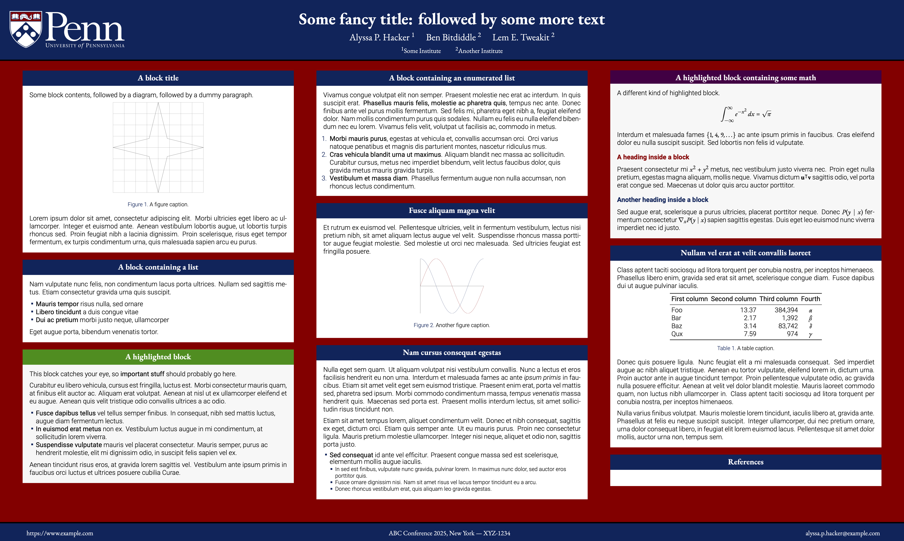

# Gemini 

gemini_penn is a fork of the [Gemini] theme with the University of Pennsylvania logo, [colors, and fonts]. This is **NOT** an official theme.

## Example

## Available colors

The following colors are defined:

- pennlightblue: {RGB}{130, 175, 211}
- pennorange: {RGB}{195, 90, 0}
- penngreen: {RGB}{0, 142, 0}
- pennyellow: {RGB}{242, 193, 0}
- pennpurple: {RGB}{74, 0, 66}
- penngray1: {RGB}{247, 247, 247}
- penngray2: {RGB}{242, 242, 242}
- penngray3: {RGB}{204, 204, 204}
- penngray4: {RGB}{153, 153, 153}
- penngray5: {RGB}{51, 51, 51}

[Gemini]: https://github.com/anishathalye/gemini/
[colors, and fonts]: https://branding.web-resources.upenn.edu/web-identity